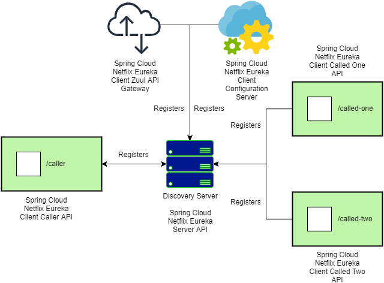
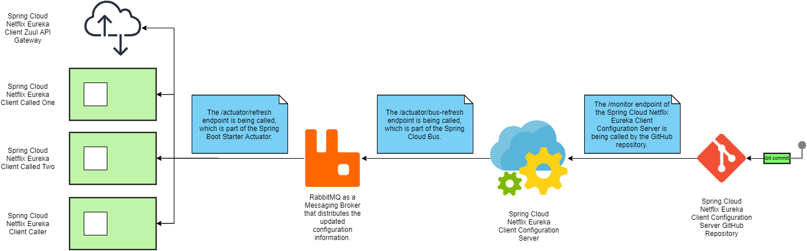
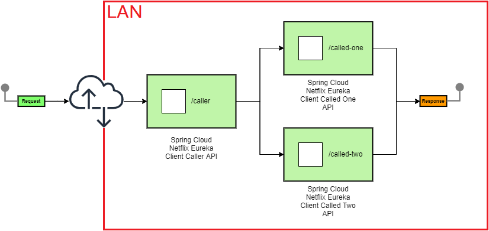
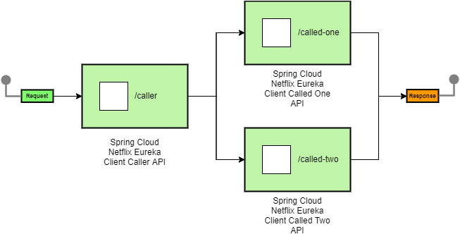

# [Spring Cloud Netflix Eureka](https://spring.io/projects/spring-cloud-netflix)

[](https://www.oracle.com/java/technologies/javase/jdk14-archive-downloads.html)
[](https://mvnrepository.com/artifact/org.springframework.boot/spring-boot-starter-parent/2.3.5.RELEASE)
[](http://maven.apache.org/download.cgi)
[](https://docs.docker.com/compose/compose-file)

## Content

- [Introduction](#introduction)
- [Getting Started](#getting-started)
- [Author](#author)

### Introduction <a name="introduction"></a>

This project is an example of how Service Discovery is happening when working with Spring Cloud Netflix Eureka Server &
Client in a microservice based architecture. The URI used to access
the [Spring Cloud Netflix Eureka Discovery Server GUI](http://localhost:8761/api-jva-spring-boot-spring-cloud-netflix-eureka-server)
, to check all the registered Spring Cloud Netflix Eureka Clients.



All microservices in the distributed system are defined as Spring Cloud Configuration Clients and are pulling their
configuration information from
the [Spring Cloud Configuration Server](http://localhost:8888/api-jva-spring-boot-spring-cloud-netflix-eureka-client-configuration-server)
, which actually connects to
the [GitHub repository](https://github.com/vtalevski/api-jva-spring-boot-spring-cloud-netflix-oss-configuration-server-github-repository.git)
. To make the information pulling from the GitHub repository to the Spring Cloud Netflix Eureka Client Configuration
Server dynamic, Local Tunnel is used to assign
a [public hostname](https://netflix-oss-configuration-server-hostname.loca.lt/api-jva-spring-boot-spring-cloud-netflix-eureka-client-configuration-server)
to the Spring Cloud Netflix Eureka Client Configuration Server's localhost port, because the GitHub webhooks only work
with public hostnames. Further more, the Spring Cloud Bus together with the RabbitMQ as a messaging broker are used to
distribute the changes from the Spring Cloud Netflix Eureka Client Configuration Server to all the Spring Cloud
Configuration Clients. This is possible by using the '/monitor' endpoint, and the '/actuator/bus-refresh' endpoint of
the Spring Cloud Eureka Client Configuration Server, and the '/actuator/refresh' endpoint of the Spring Cloud
Configuration Clients.



In order to access the Spring Cloud Netflix Eureka Client Caller Spring Boot API within the LAN from the Internet,
the [Spring Cloud Netflix Zuul API Gateway](http://localhost:8090/api-jva-spring-boot-spring-cloud-netflix-eureka-client-zuul-api-gateway/api-jva-spring-boot-spring-cloud-netflix-eureka-client-caller/caller)
is configured. Local Tunnel is used to assign
a [public hostname](https://netflix-oss-zuul-api-gateway-hostname.loca.lt/api-jva-spring-boot-spring-cloud-netflix-eureka-client-zuul-api-gateway/api-jva-spring-boot-spring-cloud-netflix-eureka-client-caller/caller)
to the Spring Cloud Netflix Eureka Client Zuul API Gateway's localhost port.



Additionally, on the Spring Cloud Netflix Eureka Client Caller Spring Boot API side, the Hystrix Circuit Breaker pattern
is implemented in case of a slow microservice, and a commented example of the Hystrix Bulkhead pattern as well. Both can
be monitored using
the [Hystrix Dashboard](http://localhost:8080/api-jva-spring-boot-spring-cloud-netflix-eureka-client-caller/hystrix). To
check the graphical information,
the <http://localhost:8080/api-jva-spring-boot-spring-cloud-netflix-eureka-client-caller/actuator/hystrix.stream>
endpoint is used.

Below is the project's structure.

Four docker containers will be created from the 'docker-compose.yml' file, and are listed below.

- Spring Cloud Netflix Eureka Server Spring Boot API which is the Discovery Server where all the Spring Cloud Netflix
  Eureka Clients get discovered.
- Spring Cloud Netflix Eureka Client Configuration Server Spring Boot API which is the Configuration Server where all
  the configuration details for all the registered Spring Cloud Configuration Clients is stored.
- Spring Cloud Netflix Eureka Client Zuul API Gateway Spring Boot API which is the API Gateway that acts as a proxy when
  contacting the Spring Cloud Netflix Eureka Client Caller Spring Boot API from outside of the LAN.
- Spring Cloud Netflix Eureka Client Caller Spring Boot API that calls the Spring Cloud Netflix Eureka Client Called One
  Spring Boot API & the Spring Cloud Netflix Eureka Client Two Spring Boot API. It uses the Spring Cloud Netflix Eureka
  Server to discover the APIs that it needs to call.
- Spring Cloud Netflix Eureka Client Called One Spring Boot API that is being called by the Spring Cloud Netflix Eureka
  Client Caller Spring Boot API.
- Spring Cloud Netflix Eureka Client Called Two Spring Boot API that is being called by the Spring Cloud Netflix Eureka
  Client Caller Spring Boot API.



### Getting Started <a name="getting-started"></a>

In order to run this project, the following commands need to be executed in the given order.

- Build the project.

```
    mvn clean install
```

- Start all the docker containers.

```
    docker-compose up -d
```

- Start all the docker containers with scaling out. Scaling out the Spring Cloud Netflix Eureka Client Called One Spring
  Boot API & the Spring Cloud Netflix Eureka Client Called Two Spring Boot API is not possible using a Docker Compose
  command, because static IP addresses are used for each docker container. The static IP addresses are mandatory because
  they are used when Local Tunnel is assigning public hostnames to the Spring Cloud Netflix Eureka Client Configuration
  Server & the Spring Cloud Netflix Eureka Client Zuul API Gateway. If that was possible, to start all the docker
  containers with scaling out.

```
    docker-compose up --scale api-jva-spring-boot-spring-cloud-netflix-eureka-client-called-one-module_container=2 --scale api-jva-spring-boot-spring-cloud-netflix-eureka-client-called-two-module_container=2 -d
```

- Stop all the docker containers

```
    docker-compose down
```

When running the projects locally, the additional following commands need to be executed in the given order to assign
public hostnames to the Spring Cloud Netflix Eureka Client Configuration Server & the Spring Cloud Netflix Eureka Client
Zuul API Gateway.

- Install NPM.

```
    npm install -g localtunnel
```

- Assign a public hostname to the Spring Cloud Netflix Eureka Client Configuration Server.

```
    lt --port 8888 --subdomain netflix-oss-configuration-server-hostname
```

- Assign a public hostname to the Spring Cloud Netflix Eureka Client Zuul API Gateway.

```
    lt --port 8090 --subdomain netflix-oss-zuul-api-gateway-hostname
```

### Author <a name="author"></a>

[Viktor Talevski](https://www.linkedin.com/in/viktor-talevski-a7366794)
